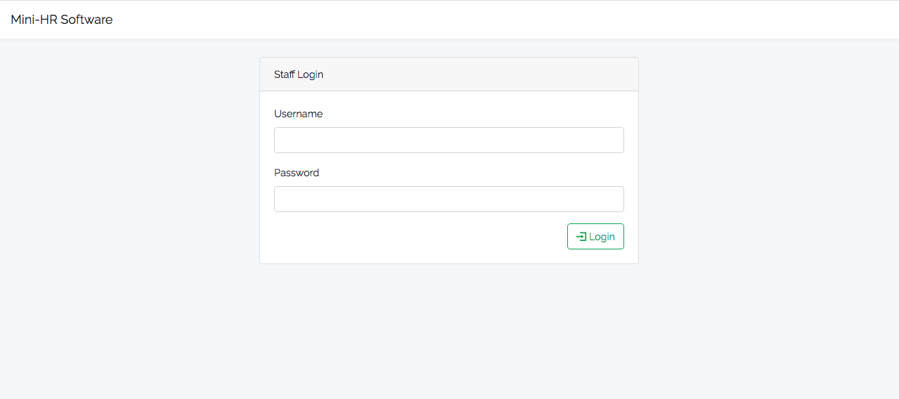

# Mini HR
Mini HR software project.



## Prerequisites
-   ``python >= 3.5``
-   ``python3-dev & default-libmysqlclient-dev`` #Debian Users
-   Mac Users [follow this link](https://github.com/PyMySQL/mysqlclient-python) to get the prerequisites

## Installation
Open terminal in desired directory and run these commands

```sh
git clone https://github.com/kodjunkie/mini-hr.git
cd mini_hr
pip3 install -r requirements.txt
```

Then open ``.dbconfig`` environment file and update database details, then run

```sh
python3 manage.py collectstatic
python3 manage.py migrate
```

Create super user who will manage the staffs

```sh
python3 manage.py createsuperuser --email name@domain.com --username name
```

Finally, start the server with this command

```sh
python3 manage.py runserver
```

## After Installation
Visit these links in your browser

    http://localhost:8000 - Users
    http://localhost:8000/admin - Adminstrator / Super user

## How is works
-   Only the super user can create staffs
-   Staffs can then login to update their profile with other required details
-   The super user can browser staff data
-   Search by 'email', 'phone', 'department', 'position'
-   And also filter by 'department', 'is active' and 'work status'

## Added features
-   The super user can send emails to all or selected users
-   For the sake of demo, the message is logged to the console
-   I have also added some tests

### Test
To run unit test, use

```sh
python3 manage.py test users
```

:heart: